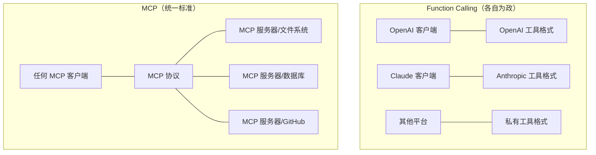
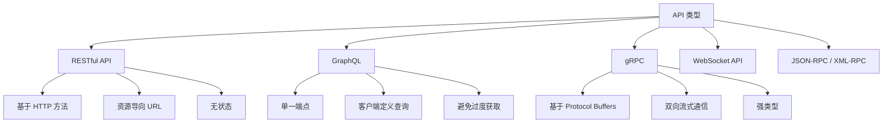

## 概述

2025-2026 年，AI 工具生态经历了一次根本性的范式转移：**AI 不再只是对话窗口里的聊天机器人，而是可以直接操作文件、调用数据库、执行命令的自主 Agent**。支撑这个转变的三项关键技术——MCP、API、Skill——分别解决了不同层面的问题。

这篇文章不是零散的概念介绍，而是从**历史演进的逻辑**出发，讲清楚这三者各自解决什么问题、怎么用、以及它们之间的关系。

---

## 一、历史的演进：工具调用能力的三个时代

### 1.1 第一代：传统 API 时代（2000s - 2023）

API 是软件系统之间通信的标准方式。一个系统暴露 API，另一个系统通过 HTTP/PRC 调用它。这是互联网过去二十年的基础设施。

```json
// 传统 REST API 调用
POST /api/weather/current
Content-Type: application/json
Authorization: Bearer xxx

{
    "city": "重庆",
    "units": "celsius"
}

// 返回
{
    "code": 200,
    "data": {
        "temperature": 28,
        "humidity": 75,
        "wind": "3级"
    }
}
```

API 的特点是：**接口是固定的，调用者需要知道确切的端点、参数格式、认证方式**。

在 AI 出现之前，API 的调用者是人（前端开发者在浏览器中调用，后端开发者用 curl 测试，运维用脚本轮询）。**API 本身没有智能，它只负责响应请求。**

- 开发者需要阅读文档理解接口规范
- 参数必须精确匹配，不能有歧义
- 返回格式固定，需要调用方自行解析处理

这个时代的核心问题是：**AI 要调用工具，需要先理解 API 文档，然后按格式组装请求。每次对接一个新工具都要写大量胶水代码。**

### 1.2 第二代：Function Calling（2023 - 2024）

OpenAI 在 GPT-4 时代引入了 Function Calling（函数调用），这是 AI 能调用外部工具的起点。它的核心思想是：**把 API 描述告诉模型，模型自己决定什么时候调用、传什么参数**。

```json
{
    "tools": [
        {
            "type": "function",
            "function": {
                "name": "get_weather",
                "description": "获取指定城市的当前天气",
                "parameters": {
                    "type": "object",
                    "properties": {
                        "city": { "type": "string", "description": "城市名称" },
                        "units": { "type": "string", "enum": ["celsius", "fahrenheit"] }
                    }
                }
            }
        }
    ]
}
```

**Function Calling 的工作原理**：

1. 开发者在 API 请求中声明可用的函数（包括函数名、描述、参数 schema）
2. 用户向 AI 提问："重庆今天热吗？"
3. 模型理解意图，返回一个特殊的响应：`{"tool_calls": [{"name": "get_weather", "args": {"city": "重庆"}}]}`
4. 开发者拿到这个响应，在自己的代码中调用真实的 weather API
5. 把结果返回给模型，模型生成最终回答

这比传统 API 前进了一大步：**AI 可以自主决定调用哪个工具**。但问题也很明显：

| 问题 | 影响 |
|------|------|
| 每次都要把工具描述塞进 prompt | 工具多了 token 消耗巨大 |
| 没有标准化的工具发现机制 | 每个平台各自实现，互不兼容 |
| 工具执行由客户端完成 | 模型无法直接操作文件系统 |
| 没有资源模型 | 只能调用函数，不能"读取"或"订阅"资源 |

Function Calling 是一个重要的过渡方案，但它没有解决工具的标准化问题。每个 AI 平台（OpenAI、Anthropic、Google）都有自己的 function calling 格式，开发者要为每个平台写不同的适配层。

### 1.3 第三代：MCP 时代（2024 - 至今）

MCP（Model Context Protocol）由 Anthropic 在 2024 年底提出，2025 年迅速成为行业标准。它解决的是 Function Calling 时代没有解决的标准化问题。

**MCP 的核心思想**：把工具调用从"私有协议"变成"开放标准"，就像 HTTP 把超文本传输从私有协议变成了互联网标准一样。



**MCP 不是一个产品，而是一个协议**。它定义了 AI 客户端（如 opencode、Claude Desktop）如何与工具服务器（如文件系统、数据库、GitHub）通信。

### 1.4 第四代：Skill（技能的封装）

如果说 MCP 解决了"AI 怎么调用工具"的问题，Skill 解决的是"AI 怎么完成特定任务"的问题。

**一个 Skill 是一组指令 + 工具的封装**，它告诉 AI 如何完成某个领域的特定任务。比如：
- "写高校信息化建设方案"这个 Skill 包含：方案模板、写作规范、相关 MCP 工具、审核标准
- "代码审查"这个 Skill 包含：审查规则、安全 checklist、相关工具

Skill 在 MCP 之上再加了一层：**它不只是给 AI 工具，还给了 AI 如何思考、如何决策的方法论**。

---

## 二、MCP 详解

### 2.1 MCP 是什么

MCP（Model Context Protocol）是一个开放协议，定义了 AI 客户端与工具/数据源之间的通信标准。它可以理解为 **"AI 应用的 USB-C 接口"**——一个统一的接口让 AI 连接任何工具和数据。

```
┌─────────────────┐         MCP 协议          ┌──────────────────┐
│  AI 客户端       │ ◄──────────────────────► │  MCP 服务器       │
│  （opencode、     │                          │  （文件系统、      │
│   Claude Desktop、│     JSON-RPC 通信        │   数据库、GitHub、 │
│   VS Code 等）    │     stdin/stdout 或     │   浏览器等）       │
│                   │     SSE/WebSocket        │                   │
└─────────────────┘                           └──────────────────┘
```

MCP 采用了**客户端-服务器架构**：

- **MCP 客户端**（通常是 AI 应用）：opencode、Claude Desktop、VS Code 扩展等
- **MCP 服务器**（工具提供方）：暴露特定的能力，如文件读写、数据库查询、Git 操作
- **MCP 协议**：定义两者之间的通信规范

### 2.2 协议传输层

MCP 支持两种传输方式：

```
┌──────────────────────────────────────────────────┐
│                  传输层                           │
├──────────────────────────────────────────────────┤
│  1. stdio（标准输入/输出）                          │
│     MCP 服务器作为子进程启动                       │
│     通过 stdin/stdout 通信                        │
│     适合：本地工具、文件系统操作                   │
│                                                   │
│  2. SSE（Server-Sent Events）                     │
│     MCP 服务器作为独立 HTTP 服务运行               │
│     通过 HTTP 长连接通信                          │
│     适合：远程服务、需要共享的工具                 │
└──────────────────────────────────────────────────┘
```

stdio 传输的典型配置：

```jsonc
// opencode.jsonc
{
    "mcp": {
        "filesystem": {
            "type": "local",
            "command": ["npx", "-y", "@modelcontextprotocol/server-filesystem", "/path/to/allowed"],
            "description": "安全受限的文件系统访问"
        }
    }
}
```

SSE 传输的典型配置（本地使用 npx 启动远程连接）：

```jsonc
{
    "mcp": {
        "remote-db": {
            "type": "local",
            "command": ["npx", "-y", "@mcp/server-sse-proxy", "--url", "https://mcp.example.com/sse"],
            "description": "远程数据库查询服务"
        }
    }
}
```

### 2.3 协议消息层 —— JSON-RPC

MCP 的所有通信都基于 **JSON-RPC 2.0**。JSON-RPC 是一种轻量级的远程过程调用协议，和 XML-RPC 类似但使用 JSON 格式。

**三种基本消息类型**：

```jsonc
// 1. 请求（Request）：客户端 → 服务器
{
    "jsonrpc": "2.0",
    "id": 1,
    "method": "tools/call",
    "params": {
        "name": "read_file",
        "arguments": {
            "path": "/workspace/config.json"
        }
    }
}

// 2. 成功响应（Success Response）：服务器 → 客户端
{
    "jsonrpc": "2.0",
    "id": 1,
    "result": {
        "content": [
            {
                "type": "text",
                "text": "{\"server\": {\"port\": 8080}}"
            }
        ]
    }
}

// 3. 错误响应（Error Response）：服务器 → 客户端
{
    "jsonrpc": "2.0",
    "id": 1,
    "error": {
        "code": -32000,
        "message": "File not found",
        "data": {
            "path": "/workspace/config.json"
        }
    }
}

// 4. 通知（Notification）：无 ID，不需要响应
{
    "jsonrpc": "2.0",
    "method": "notifications/initialized"
}
```

**为什么用 JSON-RPC 而不是 REST？** JSON-RPC 更适合 MCP 的场景：

| 特性 | REST | JSON-RPC |
|------|------|----------|
| 接口定义 | URL + Method 组合 | 一个端点，method 字段区分 |
| 批量操作 | 不支持（需要多个请求） | 支持一次发送多个请求 |
| 双向通信 | 请求-响应模式 | 支持服务器主动推送通知 |
| 连接数 | 一个连接处理一个请求 | 一个连接处理多个请求（复用） |
| 适用场景 | 资源型 CRUD | 动作型/过程型调用 |

MCP 的核心是"调用工具"和"获取资源"，这是动作型的，天然适合 JSON-RPC。

### 2.4 MCP 的原语

MCP 定义了三种核心原语，对应 AI 与工具交互的三种基本模式：

#### 原语一：Tools（工具）

Tools 是 AI 可以调用的函数。每个 tool 有名称、描述和输入参数定义。这是 MCP 最常用的原语，对应 Function Calling 的"函数调用"。

```jsonc
// MCP 服务器的工具声明
{
    "tools": [
        {
            "name": "read_file",
            "description": "读取指定路径的文件内容",
            "inputSchema": {
                "type": "object",
                "properties": {
                    "path": {
                        "type": "string",
                        "description": "文件路径"
                    }
                },
                "required": ["path"]
            }
        },
        {
            "name": "write_file",
            "description": "写入内容到指定文件",
            "inputSchema": {
                "type": "object",
                "properties": {
                    "path": { "type": "string" },
                    "content": { "type": "string" },
                    "append": { "type": "boolean", "description": "是否追加模式" }
                },
                "required": ["path", "content"]
            }
        }
    ]
}
```

**关键特性**：

- AI 客户端通过 `tools/list` 获取可用工具列表
- AI 通过 `tools/call` 调用具体工具
- 工具执行结果以结构化内容返回（text、image、resource 等类型）
- 工具是"有副作用的"——调用工具可能会修改系统状态

MCP 服务器中注册工具的实际代码（以 TypeScript 为例，用官方 SDK）：

```typescript
import { Server } from "@modelcontextprotocol/sdk/server/index.js";
import { StdioServerTransport } from "@modelcontextprotocol/sdk/server/stdio.js";
import {
    CallToolRequestSchema,
    ListToolsRequestSchema,
} from "@modelcontextprotocol/sdk/types.js";

const server = new Server(
    { name: "example-fs-server", version: "1.0.0" },
    { capabilities: { tools: {} } }
);

// 处理 tools/list 请求
server.setRequestHandler(ListToolsRequestSchema, async () => ({
    tools: [
        {
            name: "read_file",
            description: "读取文件内容",
            inputSchema: {
                type: "object",
                properties: {
                    path: { type: "string" }
                },
                required: ["path"]
            }
        }
    ]
}));

// 处理 tools/call 请求
server.setRequestHandler(CallToolRequestSchema, async (request) => {
    const { name, arguments: args } = request.params;

    if (name === "read_file") {
        const content = await fs.readFile(args.path, "utf-8");
        return {
            content: [{ type: "text", text: content }]
        };
    }

    throw new Error(`Unknown tool: ${name}`);
});

// 启动服务器（stdio 传输）
const transport = new StdioServerTransport();
await server.connect(transport);
```

#### 原语二：Resources（资源）

Resources 是 AI 可以读取的"数据源"。和 Tools 不同，Resources 是**无副作用的**——读取资源不会改变系统状态。

```jsonc
{
    "resources": [
        {
            "uri": "file:///workspace/config.json",
            "name": "Project Configuration",
            "description": "项目配置文件",
            "mimeType": "application/json"
        },
        {
            "uri": "file:///workspace/README.md",
            "name": "Project README",
            "description": "项目说明文档",
            "mimeType": "text/markdown"
        }
    ]
}
```

**Resources 的用途**：AI 客户端可以通过 `resources/list` 获取资源列表，通过 `resources/read` 读取资源内容。这比 Tools 更轻量——AI 不需要"调用"，只需要"读取"。

实际场景：AI 在开始编码之前，通过 Resources 读取项目的 package.json、README、配置文件，了解项目上下文。

#### 原语三：Prompts（提示模板）

Prompts 是预定义的提示词模板，封装了特定场景的最佳实践。

```jsonc
{
    "prompts": [
        {
            "name": "code_review",
            "description": "执行代码审查",
            "arguments": [
                {
                    "name": "language",
                    "description": "编程语言",
                    "required": true
                }
            ]
        }
    ]
}
```

**Prompts 的用途**：客户端可以获取这些模板并呈现给用户。用户选择后填充参数，模板展开成完整的 prompt。这本质上是"可复用的 AI 指令"。

### 2.5 会话生命周期

一个完整的 MCP 会话流程：

```
客户端                              MCP 服务器
  │                                      │
  │  ── 1. 建立连接（stdio/SSE）─────► │
  │                                     │
  │  ◄── 2. server.info ─────────────── │
  │       (名称、版本、能力声明)          │
  │                                     │
  │  ── 3. initialize ────────────────► │
  │       (客户端信息、协议版本)          │
  │                                     │
  │  ◄── 4. initialized ──────────────  │
  │       (确认初始化完成)               │
  │                                     │
  │  ── 5. tools/list ────────────────► │
  │  ◄── [tool1, tool2, ...] ─────────  │
  │                                     │
  │  ── 6. tools/call(name="read")───►  │
  │  ◄── {content: "..."} ────────────  │
  │                                     │
  │  ── 7. tools/call(name="write")──►  │
  │  ◄── {content: "ok"} ─────────────  │
  │                                     │
  │  ── 8. 关闭连接 ──────────────────► │
```

### 2.6 MCP 的完整流程：以 opencode 为例

以 opencode 中通过 MCP 操作文件为例，展示完整的端到端流程：

**步骤 1：配置 MCP 服务器**

在 `opencode.jsonc` 中声明：

```jsonc
{
    "mcp": {
        "filesystem": {
            "type": "local",
            "command": ["npx", "-y", "@modelcontextprotocol/server-filesystem", "/Users/tanzicai/CX"],
            "description": "文件系统操作"
        }
    }
}
```

**步骤 2：opencode 启动时加载 MCP**

opencode 启动时，检测到配置中的 MCP 服务器配置，为每个服务器启动一个子进程：

```
opencode 进程
    │
    ├── 主进程（处理对话）
    │
    └── 子进程：@modelcontextprotocol/server-filesystem
         │ 通过 stdin/stdout 与主进程通信
         │ 能力：在 /Users/tanzicai/CX 范围内读写文件
```

**步骤 3：用户提问**

用户输入："帮我把这个目录下的所有 .md 文件列出来"

**步骤 4：AI 决定调用工具**

大模型（Claude/GPT）收到用户的自然语言请求，结合可用的工具列表，决定调用 `read_file` 和 `read_directory` 等工具。

**步骤 5：opencode 通过 MCP 执行**

```jsonc
// opencode → MCP 服务器
{
    "jsonrpc": "2.0",
    "id": 1,
    "method": "tools/call",
    "params": {
        "name": "read_directory",
        "arguments": { "path": "/Users/tanzicai/CX" }
    }
}

// MCP 服务器 → opencode
{
    "jsonrpc": "2.0",
    "id": 1,
    "result": {
        "content": [
            {
                "type": "text",
                "text": "[\"README.md\", \"package.json\", \"src/\", ...]"
            }
        ]
    }
}
```

**步骤 6：AI 组织回答**

模型拿到结果后，再结合对话上下文，用自然语言回复用户。

这个过程中，用户完全不需要知道底层的 MCP 通信细节。**MCP 对用户是完全透明的**——用户看到的是"AI 帮我操作了文件"，看不到的是背后的一系列 JSON-RPC 调用。

### 2.7 MCP 的核心价值

MCP 相比前代技术的核心进步：

| 特性 | 传统 API | Function Calling | MCP |
|------|----------|-----------------|-----|
| 标准化 | 每个 API 各自定义 | 每个平台各自定义 | 统一协议 |
| 工具发现 | 读文档 | API 定义中声明 | tools/list |
| 资源模型 | 无 | 无 | Resources 原语 |
| 订阅机制 | 无 | 无 | 支持服务器推送 |
| 传输协议 | HTTP | HTTP | stdio / SSE |
| 互操作性 | 低 | 低 | 高 |
| 安全性 | 各自实现 | 各自实现 | 统一能力边界 |

---

## 三、API 详解

### 3.1 API 的本质

API（Application Programming Interface）是**软件系统之间预定好的通信契约**。它定义了：
- 我能做什么（端点/方法）
- 你需要给我什么（请求参数）
- 我会返回什么（响应格式）

API 的核心设计原则是**约定大于配置**——一旦约定确定，调用方和提供方可以独立开发和演进。

### 3.2 API 的类型



| 类型 | 数据格式 | 适用场景 | 优点 | 缺点 |
|------|---------|---------|------|------|
| REST | JSON/XML | 通用的 CRUD 操作 | 简单、缓存友好 | 过度获取/不足获取 |
| GraphQL | GraphQL DSL | 复杂数据查询 | 精确获取、强类型 | 缓存复杂、查询性能难预测 |
| gRPC | Protobuf | 微服务间通信 | 高性能、强类型、流式 | 浏览器支持有限 |
| WebSocket | 任意 | 实时通信 | 双向、低延迟 | 无标准消息格式 |
| JSON-RPC | JSON | 动作调用、工具调用 | 简单直接 | 发现机制有限 |

### 3.3 REST API 标准

REST 是目前最常见的 API 风格，对理解 MCP 也有帮助（MCP 和 REST 的设计哲学有相似之处）：

```http
# 资源导向的 URL 设计
GET    /api/users           # 列出用户
POST   /api/users           # 创建用户
GET    /api/users/{id}      # 获取单个用户
PUT    /api/users/{id}      # 全量更新用户
PATCH  /api/users/{id}      # 部分更新用户
DELETE /api/users/{id}      # 删除用户

# 状态码规范
200 OK                      # GET/PUT/PATCH 成功
201 Created                 # POST 成功创建
204 No Content              # DELETE 成功
400 Bad Request             # 参数错误
401 Unauthorized            # 未认证
403 Forbidden               # 无权限
404 Not Found               # 资源不存在
500 Internal Server Error   # 服务器内部错误
```

### 3.4 AI 时代 API 的新角色

在 AI 时代，API 的角色发生了微妙但重要的变化：

**变化一：AI 是新的 API 消费者**

过去 API 的消费者是人（前端开发者调用后端 API）。现在 API 的消费者是 AI。这意味着 API 的设计需要考虑：
- 更自然的错误信息（AI 需要理解错误原因，而不是只看 status code）
- 更丰富的描述信息（AI 需要知道 API 是做什么的，而不是只看 endpoint）
- 更一致的返回格式（AI 不像人一样能灵活适应不同的返回结构）

**变化二：API 文档从给人看变成给 AI 看**

```markdown
## API 文档的传统写法（给人看）

### 获取天气
接口地址：GET /api/weather
参数：
  - city：城市名称
  - units：单位（celsius/fahrenheit）
返回示例：
  { "temperature": 28, "humidity": 75 }

## API 文档的 AI 友好写法

### get_weather
用途：获取指定城市的天气预报数据
适用场景：用户在询问天气、需要决定出行安排时调用
参数：
  - city：必填，城市中文名称如"重庆"、"北京"
  - units：可选，默认 celsius
行为约束：不要同时查询多个城市，一次只查一个
返回字段说明：
  - temperature：当前温度，整数
  - humidity：湿度百分比
  - wind：风力等级描述
错误处理：如果城市不存在，返回 404，此时应告知用户城市名可能错误
```

**变化三：从 API 到 MCP 的演进**

API 是"人 → 机器"的接口，MCP 是"AI → 工具"的接口。MCP 并没有取代 API——相反，MCP 服务器内部通常会调用底层 API。

```
AI 客户端
    │
    │  MCP 协议
    ▼
MCP 服务器
    │
    │  传统 API（HTTP/REST/gRPC）
    ▼
后端服务（数据库、文件系统、GitHub）
```

MCP 是 API 的**上层抽象**——它为 AI 消费 API 提供了标准化的接口，屏蔽了底层 API 的差异性。

---

## 四、Skill 详解

### 4.1 Skill 是什么

Skill 是**面向 AI 的任务能力封装**。它是一组指令、规则、工具引用和工作流程的集合，让 AI 能够完成特定领域的复杂任务。

如果说 API 和 MCP 是"给了 AI 可以用的工具"，那么 Skill 是"教 AI 怎么用这些工具完成一项工作"。

```yaml
# Skill 的结构化描述
name: proposal-writer              # 技能名称
description: 编写高校信息化建设方案   # 技能描述
version: 1.0.0

# 核心指令（告诉 AI 如何思考）
instructions:
  - 你是一个拥有10年经验的高校信息化顾问
  - 写方案前先理解客户需求，列出大纲
  - 每个方案必须包含：项目背景、建设目标、技术架构、实施计划、预算
  - 用正式书面语，专业术语需加括号备注英文
  - 避免过度技术化，突出业务价值

# 引用的 MCP 工具
mcp_tools:
  - filesystem:    # 读取方案模板和参考资料
  - web:           # 搜索相关政策和标准

# 参考文件
references:
  - path: /templates/proposal-template.docx
  - path: /guidelines/writing-style.md
```

### 4.2 Skill 的来源

Skill 的概念源于几个方向的交汇：

**1. Prompt Engineering 的演化**

最早人们用简单的 prompt 让 AI 做事。随着任务变复杂，prompt 越来越长，越来越结构化。最终人们发现：**prompt 本身可以成为一种可共享、可复用的资产**。这就是 Skill 的雏形。

```
单轮 prompt              多轮 prompt              System Prompt           Skill
   │                        │                        │                    │
   ▼                        ▼                        ▼                    ▼
"帮我写个方案"    →  第一轮列大纲              你是一个顾问            结构化指令
                    第二轮写正文              请遵循以下规则          + 工具引用
                    第三轮润色                ...                    + 参考文件
                                                                     + 工作流程
```

**2. MCP 的补充**

MCP 解决了"AI 能调用什么工具"，但没有解决"AI 应该怎么调用这些工具来完成任务"。Skill 在 MCP 之上补充了这个缺失的环节。

```
MCP 层面：AI 有文件系统工具、有数据库工具、有网络搜索工具
Skill 层面：AI 知道写方案时需要先读模板、再查政策、再写正文、最后审核
```

**3. 人机协作工作流的固化**

很多 AI 使用场景已经形成了固定的工作流。Skill 把这些工作流固化下来，变成可复用的模式。

所有 Skill 本质上都是对"人类最佳实践"的封装。

### 4.3 Skill 的实现机制

以 opencode 的 Skill 为例，深入理解 Skill 的工作方式：

**Skill 的物理存储**：Skill 是一个目录，包含：

```
~/.config/opencode/skills/proposal-writer/
├── SKILL.md          # 核心指令文件
├── references/       # 参考文件
│   ├── template.docx
│   └── style-guide.md
└── scripts/         # 辅助脚本（可选）
    └── generate-docx.py
```

**SKILL.md 的核心内容**：

```markdown
# proposal-writer

你是一个资深的高校信息化建设顾问。
你的任务是帮助用户编写高质量的建设方案、可行性报告和投标文件。

## 工作流程

1. 需求分析
   - 先理解用户的学校类型、预算规模、核心需求
   - 列出方案大纲，请用户确认

2. 方案编写
   - 参考 /references/ 中的模板格式
   - 每个章节包含：核心观点 → 详细展开 → 案例支撑
   - 使用 MCP 文件系统工具读取已有的方案作为参考

3. 审核
   - 自检清单：
     [ ] 是否有明确的建设目标
     [ ] 技术架构是否合理
     [ ] 预算是否具体
     [ ] 实施计划是否可行

4. 输出
   - 生成 Markdown 版本供用户在 Obsidian 中编辑
   - 如有需要，使用 generate-docx.py 生成 Word 版本

## 写作规范

- 使用正式书面语，不使用口语化表达
- 英文专业术语保留并加括号备注中文
- 每个段落不超过 5 句话
- 不使用"首先其次最后"等模板化过渡词
```

**Skill 的加载过程**：

```
用户输入："帮我写一份智慧课堂的建设方案"
    │
    ▼
opencode 检测到任务类型
    │
    ▼
加载对应的 Skill（proposal-writer 技能）
    │
    ├── 读取 SKILL.md → 注入系统 prompt
    ├── 加载 MCP 工具引用
    └── 提供参考文件路径
    │
    ▼
AI 开始按照 Skill 定义的工作流执行任务
```

加载 Skill 后，系统 prompt 相当于变成了：

```
[系统指令]
你是一个资深的高校信息化建设顾问...
你的工作流程是：
1. 需求分析...
2. 方案编写...
3. 审核...
4. 输出...

[可用工具]
- filesystem MCP（读写文件）
- web MCP（搜索信息）

[用户问题]
帮我写一份智慧课堂的建设方案
```

### 4.4 Skill 的分类

| 类型 | 示例 | 核心内容 |
|------|------|---------|
| **写作类** | proposal-writer、doc-generator | 写作规范、模板、审核清单 |
| **分析类** | tech-review、code-reviewer | 分析框架、检查项、评分标准 |
| **设计类** | solution-architect、project-plan | 设计原则、方法论、模板 |
| **优化类** | humanizer-zh | 去 AI 味规则、替换词表 |
| **配置类** | customize-opencode | 配置项说明、最佳实践 |

### 4.5 Skill 与 MCP 的关系

Skill 和 MCP 不是竞争关系，而是**互补的层级关系**：

```
                    ┌──────────────────────┐
                    │       Skill          │
                    │  （任务能力封装）      │
                    │  如何完成特定工作     │
                    └──────────┬───────────┘
                               │ 使用
                    ┌──────────▼───────────┐
                    │       MCP            │
                    │  （工具访问协议）      │
                    │  如何调用外部工具     │
                    └──────────┬───────────┘
                               │ 调用
                    ┌──────────▼───────────┐
                    │       API            │
                    │  （系统通信接口）      │
                    │  系统间如何通信       │
                    └──────────────────────┘
```

**Skill 使用 MCP 工具**：一个 Skill 可以声明它需要哪些 MCP 工具。当 Skill 被加载时，对应的 MCP 服务器也被激活。

**MCP 调用底层 API**：MCP 服务器的实现内部往往会调用传统 API。比如一个 GitHub MCP 服务器内部调用 GitHub REST API。

**API 提供基础能力**：API 是软件通信的基础设施，MCP 和 Skill 都建立在 API 之上。

这种层级关系类似于前端开发的"组件 → 框架 → 浏览器 API"：

```
Skill（组件：封装了 UI 和行为）
    │
MCP（框架：提供了标准化的接口）
    │
API（浏览器 API：操作系统能力）
```

---

## 五、三者的协作实战

### 5.1 完整场景：用 opencode 写一篇博客

以我写博客为例，展示三个层级的协作：

```
用户："帮我写一篇关于 MCP 的技术博客"

1. Skill 层加载
   └── opencode 加载 doc-generator 技能
       ├── 写作规范：技术文章结构
       ├── 风格指南：清晰、有代码示例
       └── 工作流：大纲 → 初稿 → 审校

2. MCP 层调用
   ├── filesystem：读取已有的博客文章作为参考
   ├── git：创建新分支、提交文件
   └── web：搜索相关资料

3. API 层通信
   ├── Anthropic API：调用 Claude 模型
   ├── GitHub API：通过 MCP 的 git 工具调用
   └── 文件系统 API：通过 MCP 的 filesystem 调用
```

用户看到的只有一句话的输入，背后是三层协议的协同工作。

### 5.2 从零开始配置的完整流程

如果你是一个开发者想搭建自己的 AI 工作环境，三个层级的配置示例：

**第一步：获取 API Key（API 层）**

```bash
# 注册并获取 AI 模型的 API Key
export ANTHROPIC_API_KEY=sk-ant-xxx
export OPENAI_API_KEY=sk-xxx

# 其他可能需要 API 的服务
export GITHUB_TOKEN=ghp_xxx
export NOTION_API_KEY=ntn_xxx
```

**第二步：配置 MCP 服务器（MCP 层）**

```jsonc
// opencode.jsonc
{
    "mcp": {
        "filesystem": {
            "type": "local",
            "command": ["npx", "-y", "@modelcontextprotocol/server-filesystem", "/Users/me/workspace"],
            "description": "在 workspace 范围内读写文件"
        },
        "github": {
            "type": "local",
            "command": ["npx", "-y", "@modelcontextprotocol/server-github"],
            "environment": {
                "GITHUB_TOKEN": "${GITHUB_TOKEN}"
            },
            "description": "GitHub 仓库操作"
        },
        "ticktick": {
            "type": "local",
            "command": ["npx", "-y", "@ticktick/mcp-server"],
            "environment": {
                "API_TOKEN": "${TICKTICK_TOKEN}"
            },
            "description": "滴答清单任务管理"
        }
    }
}
```

**第三步：安装 Skill（Skill 层）**

```bash
# 从官方仓库安装 Skill
opencode skill install proposal-writer
opencode skill install doc-generator
opencode skill install tech-review

# 加载 Skill
opencode skill load proposal-writer

# 现在你可以说：
# "帮我把这个需求写成建设方案"
# AI 就会按照 Skill 定义的工作流执行
```

### 5.3 协议对比一览

| 维度 | API | MCP | Skill |
|------|-----|-----|-------|
| **诞生时间** | 2000s | 2024 | 2025 |
| **核心问题** | 系统间如何通信 | AI 如何调用工具 | AI 如何完成任务 |
| **接口形式** | HTTP 端点 | JSON-RPC 方法 | Markdown 指令 |
| **数据格式** | JSON/XML/Protobuf | JSON-RPC | Markdown/YAML |
| **传输方式** | HTTP/HTTPS | stdio/SSE | 文件加载 |
| **发现机制** | 文档/OpenAPI | tools/list | skill list |
| **消费者** | 开发者 | AI 模型 | AI Agent |
| **标准化组织** | IETF/W3C | Anthropic 主导 | 各平台自定义 |
| **生态规模** | 千万级 | 千级（快速增长） | 百级（早期） |
| **相互依赖** | 基础层 | 依赖 API | 依赖 MCP + API |

---

## 六、趋势与展望

### 6.1 MCP 的下一步

- **MCP over HTTP**：目前 stdio 传输占主导，未来 SSE/WebSocket 会普及，远程 MCP 服务器会成为主流
- **MCP Registry**：类似 npm 或 Docker Hub 的 MCP 服务器注册中心，方便发现和安装工具
- **权限模型**：更细粒度的权限控制，让用户可以精确控制 AI 能做什么
- **流式结果**：工具返回大文件时支持流式传输

### 6.2 API 的演变方向

- **AI-native API**：新 API 在设计时就考虑 AI 消费场景，提供语义描述和意图理解支持
- **API 即 MCP**：越来越多的服务直接提供 MCP 接口，而不仅仅是 REST API
- **智能 API 网关**：网关层自动将传统 API 包装成 MCP 兼容接口

### 6.3 Skill 的生态化

- **Skill Store**：类似 App Store 的技能市场，用户可以安装分享的技能
- **Skill 组合**：多个 Skill 串联成复杂工作流（proposal-writer + humanizer-zh 自动衔接）
- **社区标准化**：Skill 格式可能走向标准化，跨平台兼容

---

## 七、写在最后

API、MCP、Skill 代表了技术抽象的三个层级：

- **API 定义了能力**：系统之间能做什么
- **MCP 标准化了接入**：AI 怎么发现和使用这些能力
- **Skill 封装了知识**：怎么用这些能力完成有价值的工作

这三者的关系不是替代，而是**递进**。Skill 依赖于 MCP，MCP 依赖于 API。每一层都在前一层的肩膀上解决新问题。

如果你是一个开发者，我的建议是：

1. **API 是基本功**：理解 REST 设计原则、JSON-RPC 协议、认证机制，这些是底层通用知识
2. **MCP 是现在**：2026 年 MCP 已经是最重要的 AI 工具协议，学会写 MCP 服务器是一项高价值技能
3. **Skill 是未来**：当工具的接入问题被 MCP 解决后，真正的价值在于"怎么让 AI 更好地完成特定任务"

十年后回头看，API 会成为基础设施（就像今天的 TCP/IP），MCP 会成为标准协议（就像今天的 HTTP），而 Skill 会成为 AI 时代的"编程语言"——定义一个 Skill 就像今天写一个函数，定义输入输出和工作逻辑。

这个变化才刚刚开始。
